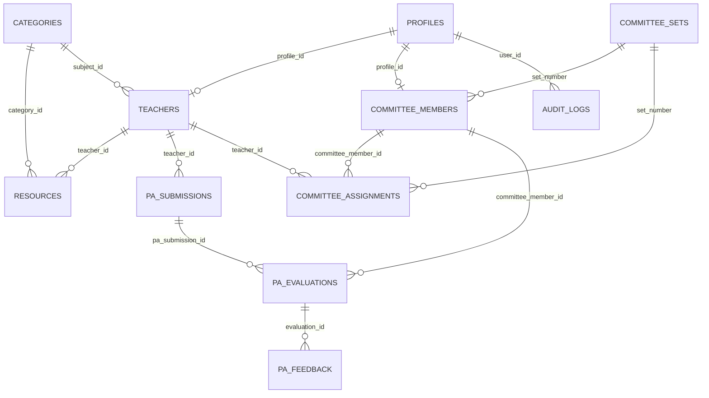

# 🗄️ Supabase PostgreSQL Database Specification
**โรงเรียนวัดบางโฉลงใน (Wat Bang Chalong Nai School)**

---

## 1. Database Entity-Relationship (ER) Overview



---

## 2. Complete PostgreSQL DDL Schema

```sql
-- =============================================================================
-- WAT BANG CHALONG NAI MEDIA & PA MANAGEMENT SYSTEM
-- PRODUCTION POSTGRESQL SCHEMA SPECIFICATION
-- =============================================================================

-- Enable required extensions
CREATE EXTENSION IF NOT EXISTS "uuid-ossp";
CREATE EXTENSION IF NOT EXISTS "pgcrypto";

-- Clean custom types
DO $$ BEGIN
    CREATE TYPE user_role AS ENUM ('admin', 'teacher', 'committee');
EXCEPTION
    WHEN duplicate_object THEN null;
END $$;

DO $$ BEGIN
    CREATE TYPE resource_status AS ENUM ('approved', 'pending', 'rejected');
EXCEPTION
    WHEN duplicate_object THEN null;
END $$;

DO $$ BEGIN
    CREATE TYPE pa_status AS ENUM ('draft', 'submitted', 'in_review', 'completed');
EXCEPTION
    WHEN duplicate_object THEN null;
END $$;

DO $$ BEGIN
    CREATE TYPE evaluation_status AS ENUM ('pending', 'passed', 'revision', 'excellent');
EXCEPTION
    WHEN duplicate_object THEN null;
END $$;

-- -----------------------------------------------------------------------------
-- 1. TABLE: profiles (Extends auth.users)
-- -----------------------------------------------------------------------------
CREATE TABLE IF NOT EXISTS public.profiles (
    id UUID PRIMARY KEY REFERENCES auth.users(id) ON DELETE CASCADE,
    email TEXT UNIQUE NOT NULL,
    full_name TEXT NOT NULL,
    role user_role NOT NULL DEFAULT 'teacher',
    avatar_url TEXT,
    phone TEXT,
    created_at TIMESTAMPTZ NOT NULL DEFAULT NOW(),
    updated_at TIMESTAMPTZ NOT NULL DEFAULT NOW()
);

-- -----------------------------------------------------------------------------
-- 2. TABLE: categories (Subject Groups & Support Groups)
-- -----------------------------------------------------------------------------
CREATE TABLE IF NOT EXISTS public.categories (
    id TEXT PRIMARY KEY,
    name TEXT UNIQUE NOT NULL,
    color TEXT NOT NULL DEFAULT '#005BAC',
    icon_name TEXT NOT NULL DEFAULT 'BookOpen',
    description TEXT,
    sort_order INT NOT NULL DEFAULT 0,
    created_at TIMESTAMPTZ NOT NULL DEFAULT NOW()
);

-- -----------------------------------------------------------------------------
-- 3. TABLE: teachers (Official Faculty & Educational Personnel)
-- -----------------------------------------------------------------------------
CREATE TABLE IF NOT EXISTS public.teachers (
    id TEXT PRIMARY KEY, -- e.g. 't-1' or UUID
    profile_id UUID UNIQUE REFERENCES public.profiles(id) ON DELETE SET NULL,
    employee_code TEXT UNIQUE, -- Unique Government/School ID
    full_name TEXT NOT NULL,
    position TEXT NOT NULL, -- e.g. 'ประถมศึกษาปีที่ 5 (ป.5)', 'ครูผู้ช่วย', 'เจ้าหน้าที่ธุรการ'
    academic_standing TEXT, -- วิทยฐานะ: 'ครูผู้ช่วย', 'ครู', 'ครูชำนาญการ', 'ครูชำนาญการพิเศษ', 'ครูเชี่ยวชาญ'
    subject_id TEXT REFERENCES public.categories(id) ON DELETE SET NULL,
    photo_url TEXT,
    bio TEXT,
    email TEXT,
    phone TEXT,
    facebook TEXT,
    school_year TEXT NOT NULL DEFAULT '2569',
    is_active BOOLEAN NOT NULL DEFAULT TRUE,
    resources_count INT NOT NULL DEFAULT 0,
    total_downloads INT NOT NULL DEFAULT 0,
    created_at TIMESTAMPTZ NOT NULL DEFAULT NOW(),
    updated_at TIMESTAMPTZ NOT NULL DEFAULT NOW()
);

-- -----------------------------------------------------------------------------
-- 4. TABLE: resources (Media & Learning Materials)
-- -----------------------------------------------------------------------------
CREATE TABLE IF NOT EXISTS public.resources (
    id TEXT PRIMARY KEY, -- e.g. 'res-1718000000000'
    title TEXT NOT NULL,
    description TEXT,
    cover_url TEXT,
    file_url TEXT NOT NULL,
    preview_url TEXT,
    file_type TEXT NOT NULL, -- 'PDF', 'PowerPoint', 'Word', 'ZIP', 'Video', 'Canva Link', 'Google Drive Link'
    file_size TEXT,
    teacher_id TEXT NOT NULL REFERENCES public.teachers(id) ON DELETE CASCADE,
    category_id TEXT NOT NULL REFERENCES public.categories(id) ON DELETE RESTRICT,
    grade_level TEXT NOT NULL DEFAULT 'ทุกระดับชั้น',
    tags TEXT[] NOT NULL DEFAULT '{}',
    downloads INT NOT NULL DEFAULT 0 CHECK (downloads >= 0),
    views INT NOT NULL DEFAULT 0 CHECK (views >= 0),
    rating NUMERIC(3, 2) NOT NULL DEFAULT 5.00 CHECK (rating >= 0 AND rating <= 5.0),
    featured BOOLEAN NOT NULL DEFAULT FALSE,
    is_public BOOLEAN NOT NULL DEFAULT TRUE,
    status resource_status NOT NULL DEFAULT 'approved',
    created_at TIMESTAMPTZ NOT NULL DEFAULT NOW(),
    updated_at TIMESTAMPTZ NOT NULL DEFAULT NOW()
);

-- -----------------------------------------------------------------------------
-- 5. TABLE: committee_sets (Classification Metadata for Evaluation Sets)
-- -----------------------------------------------------------------------------
CREATE TABLE IF NOT EXISTS public.committee_sets (
    set_number INT PRIMARY KEY CHECK (set_number IN (1, 2, 3)),
    name TEXT NOT NULL,
    target_description TEXT NOT NULL,
    created_at TIMESTAMPTZ NOT NULL DEFAULT NOW()
);

-- Seed static definition of Committee Sets
INSERT INTO public.committee_sets (set_number, name, target_description)
VALUES
    (1, 'ชุดที่ 1: ประเมินครูชำนาญการ และครูชำนาญการพิเศษ', 'วิทยฐานะครูชำนาญการ และครูชำนาญการพิเศษ'),
    (2, 'ชุดที่ 2: ประเมินครู และครูผู้ช่วย', 'ตำแหน่งครู (ค.ศ.1) และครูผู้ช่วย'),
    (3, 'ชุดที่ 3: ประเมินครูอัตราจ้าง และบุคลากรทางการศึกษา', 'ครูอัตราจ้าง, พี่เลี้ยงเด็กพิการ/พิเศษ, ครูพี่เลี้ยง, นักการภารโรง, เจ้าหน้าที่ธุรการ')
ON CONFLICT (set_number) DO UPDATE SET
    name = EXCLUDED.name,
    target_description = EXCLUDED.target_description;

-- -----------------------------------------------------------------------------
-- 6. TABLE: committee_members (Dynamic Evaluators)
-- -----------------------------------------------------------------------------
CREATE TABLE IF NOT EXISTS public.committee_members (
    id TEXT PRIMARY KEY, -- e.g. 'comm-1-1' or UUID
    profile_id UUID UNIQUE REFERENCES public.profiles(id) ON DELETE SET NULL,
    set_number INT NOT NULL REFERENCES public.committee_sets(set_number) ON DELETE CASCADE,
    member_order INT NOT NULL CHECK (member_order >= 1),
    full_name TEXT NOT NULL,
    role TEXT NOT NULL, -- e.g. 'ประธานกรรมการ (ผู้อำนวยการสถานศึกษา)', 'กรรมการผู้ทรงคุณวุฒิภายนอก'
    position TEXT NOT NULL,
    login_code TEXT NOT NULL, -- Evaluator access code (e.g. 'bch1', 'bch2')
    avatar_url TEXT,
    phone TEXT,
    email TEXT,
    is_active BOOLEAN NOT NULL DEFAULT TRUE,
    created_at TIMESTAMPTZ NOT NULL DEFAULT NOW(),
    updated_at TIMESTAMPTZ NOT NULL DEFAULT NOW(),
    CONSTRAINT uq_committee_set_order UNIQUE (set_number, member_order)
);

-- -----------------------------------------------------------------------------
-- 7. TABLE: committee_assignments (Dynamic Teacher-Evaluator Mapping)
-- -----------------------------------------------------------------------------
CREATE TABLE IF NOT EXISTS public.committee_assignments (
    id UUID PRIMARY KEY DEFAULT uuid_generate_v4(),
    set_number INT NOT NULL REFERENCES public.committee_sets(set_number) ON DELETE CASCADE,
    teacher_id TEXT NOT NULL REFERENCES public.teachers(id) ON DELETE CASCADE,
    committee_member_id TEXT NOT NULL REFERENCES public.committee_members(id) ON DELETE CASCADE,
    school_year TEXT NOT NULL DEFAULT '2569',
    created_at TIMESTAMPTZ NOT NULL DEFAULT NOW(),
    CONSTRAINT uq_teacher_evaluator UNIQUE (teacher_id, committee_member_id, school_year)
);

-- -----------------------------------------------------------------------------
-- 8. TABLE: pa_submissions (Teacher Performance Agreement Records)
-- -----------------------------------------------------------------------------
CREATE TABLE IF NOT EXISTS public.pa_submissions (
    id TEXT PRIMARY KEY, -- e.g. 'pa-t-1-2569'
    teacher_id TEXT NOT NULL REFERENCES public.teachers(id) ON DELETE CASCADE,
    school_year TEXT NOT NULL DEFAULT '2569',
    challenge_title TEXT NOT NULL,
    challenge_description TEXT,
    expected_outcome TEXT,
    document_url TEXT, -- Google Drive / External PDF / Storage URL
    sar_url TEXT,      -- Self-Assessment Report URL
    video_url TEXT,    -- YouTube / External Video Link
    status pa_status NOT NULL DEFAULT 'draft',
    submitted_at TIMESTAMPTZ,
    created_at TIMESTAMPTZ NOT NULL DEFAULT NOW(),
    updated_at TIMESTAMPTZ NOT NULL DEFAULT NOW(),
    CONSTRAINT uq_teacher_year_pa UNIQUE (teacher_id, school_year)
);

-- -----------------------------------------------------------------------------
-- 9. TABLE: pa_evaluations (Individual Committee Member Scorecards)
-- -----------------------------------------------------------------------------
CREATE TABLE IF NOT EXISTS public.pa_evaluations (
    id TEXT PRIMARY KEY, -- e.g. 'eval_t-1_comm-1-1'
    pa_submission_id TEXT NOT NULL REFERENCES public.pa_submissions(id) ON DELETE CASCADE,
    teacher_id TEXT NOT NULL REFERENCES public.teachers(id) ON DELETE CASCADE,
    committee_member_id TEXT NOT NULL REFERENCES public.committee_members(id) ON DELETE CASCADE,
    document_checked BOOLEAN NOT NULL DEFAULT FALSE,
    document_checked_at TIMESTAMPTZ,
    document_feedback TEXT,
    video_checked BOOLEAN NOT NULL DEFAULT FALSE,
    video_checked_at TIMESTAMPTZ,
    video_feedback TEXT,
    score NUMERIC(5, 2) CHECK (score >= 0 AND score <= 100),
    status evaluation_status NOT NULL DEFAULT 'pending',
    overall_comment TEXT,
    created_at TIMESTAMPTZ NOT NULL DEFAULT NOW(),
    updated_at TIMESTAMPTZ NOT NULL DEFAULT NOW(),
    CONSTRAINT uq_submission_evaluator UNIQUE (pa_submission_id, committee_member_id)
);

-- -----------------------------------------------------------------------------
-- 10. TABLE: pa_feedback (Detailed Audit & Continuous Comments)
-- -----------------------------------------------------------------------------
CREATE TABLE IF NOT EXISTS public.pa_feedback (
    id UUID PRIMARY KEY DEFAULT uuid_generate_v4(),
    evaluation_id TEXT NOT NULL REFERENCES public.pa_evaluations(id) ON DELETE CASCADE,
    author_id TEXT NOT NULL, -- profile_id or committee_member_id
    comment_type TEXT NOT NULL DEFAULT 'general', -- 'document', 'video', 'general'
    content TEXT NOT NULL,
    created_at TIMESTAMPTZ NOT NULL DEFAULT NOW()
);

-- -----------------------------------------------------------------------------
-- 11. TABLE: news (Announcements & School Academic News)
-- -----------------------------------------------------------------------------
CREATE TABLE IF NOT EXISTS public.news (
    id TEXT PRIMARY KEY,
    title TEXT NOT NULL,
    content TEXT NOT NULL,
    image_url TEXT,
    category TEXT NOT NULL DEFAULT 'ข่าวประชาสัมพันธ์',
    author TEXT NOT NULL DEFAULT 'ฝ่ายวิชาการ',
    pinned BOOLEAN NOT NULL DEFAULT FALSE,
    created_at TIMESTAMPTZ NOT NULL DEFAULT NOW(),
    updated_at TIMESTAMPTZ NOT NULL DEFAULT NOW()
);

-- -----------------------------------------------------------------------------
-- 12. TABLE: school_documents (Official Downloads & Templates)
-- -----------------------------------------------------------------------------
CREATE TABLE IF NOT EXISTS public.school_documents (
    id TEXT PRIMARY KEY,
    title TEXT NOT NULL,
    category TEXT NOT NULL DEFAULT 'แบบฟอร์มวิชาการ',
    file_url TEXT NOT NULL,
    file_type TEXT NOT NULL DEFAULT 'PDF',
    file_size TEXT,
    downloads INT NOT NULL DEFAULT 0 CHECK (downloads >= 0),
    created_at TIMESTAMPTZ NOT NULL DEFAULT NOW(),
    updated_at TIMESTAMPTZ NOT NULL DEFAULT NOW()
);

-- -----------------------------------------------------------------------------
-- 13. TABLE: featured_videos (YouTube Showcase Gallery)
-- -----------------------------------------------------------------------------
CREATE TABLE IF NOT EXISTS public.featured_videos (
    id TEXT PRIMARY KEY,
    title TEXT NOT NULL,
    youtube_url TEXT NOT NULL,
    youtube_id TEXT NOT NULL,
    description TEXT,
    created_at TIMESTAMPTZ NOT NULL DEFAULT NOW()
);

-- -----------------------------------------------------------------------------
-- 14. TABLE: audit_logs (Security & Transaction History)
-- -----------------------------------------------------------------------------
CREATE TABLE IF NOT EXISTS public.audit_logs (
    id UUID PRIMARY KEY DEFAULT uuid_generate_v4(),
    user_id UUID REFERENCES public.profiles(id) ON DELETE SET NULL,
    action TEXT NOT NULL, -- 'LOGIN', 'CREATE_RESOURCE', 'SUBMIT_PA', 'SAVE_EVALUATION', etc.
    target_entity TEXT NOT NULL, -- 'resources', 'pa_submissions', 'pa_evaluations'
    target_id TEXT,
    details JSONB DEFAULT '{}'::jsonb,
    ip_address TEXT,
    created_at TIMESTAMPTZ NOT NULL DEFAULT NOW()
);

-- -----------------------------------------------------------------------------
-- 15. INDEXES FOR HIGH-PERFORMANCE QUERYING
-- -----------------------------------------------------------------------------
CREATE INDEX IF NOT EXISTS idx_resources_category ON public.resources(category_id);
CREATE INDEX IF NOT EXISTS idx_resources_teacher ON public.resources(teacher_id);
CREATE INDEX IF NOT EXISTS idx_resources_status ON public.resources(status);
CREATE INDEX IF NOT EXISTS idx_pa_evaluations_teacher ON public.pa_evaluations(teacher_id);
CREATE INDEX IF NOT EXISTS idx_pa_evaluations_committee ON public.pa_evaluations(committee_member_id);
CREATE INDEX IF NOT EXISTS idx_committee_members_set ON public.committee_members(set_number);
CREATE INDEX IF NOT EXISTS idx_assignments_teacher ON public.committee_assignments(teacher_id);
CREATE INDEX IF NOT EXISTS idx_audit_logs_user ON public.audit_logs(user_id);
```

---

## 3. Database Functions & Views for Consensus & Set Matching

### 3.1. Strict Deterministic Teacher Set Classification Function
```sql
CREATE OR REPLACE FUNCTION public.fn_get_teacher_set_number(p_academic_standing TEXT, p_position TEXT)
RETURNS INT AS $$
DECLARE
    v_standing TEXT := TRIM(COALESCE(p_academic_standing, ''));
    v_position TEXT := TRIM(COALESCE(p_position, ''));
BEGIN
    -- SET 1: ครูชำนาญการ และ ครูชำนาญการพิเศษ (EXACT MATCH)
    IF v_standing IN ('ครูชำนาญการพิเศษ', 'ชำนาญการพิเศษ', 'ครูชำนาญการ', 'ชำนาญการ') 
       OR (v_standing = '' AND v_position IN ('ครูชำนาญการพิเศษ', 'ชำนาญการพิเศษ', 'ครูชำนาญการ', 'ชำนาญการ')) THEN
        RETURN 1;
    END IF;

    -- Disqualify Set 1 and Support staff before checking Set 2
    IF v_standing IN ('ครูอัตราจ้าง', 'อัตราจ้าง', 'พี่เลี้ยงเด็กพิการ', 'พี่เลี้ยงเด็กพิเศษ', 'ครูพี่เลี้ยง', 'พี่เลี้ยง', 'นักการภารโรง', 'นักการ', 'ภารโรง', 'เจ้าหน้าที่', 'ธุรการ', 'เจ้าหน้าที่ธุรการ')
       OR v_position IN ('ครูอัตราจ้าง', 'อัตราจ้าง', 'พี่เลี้ยงเด็กพิการ', 'พี่เลี้ยงเด็กพิเศษ', 'ครูพี่เลี้ยง', 'พี่เลี้ยง', 'นักการภารโรง', 'นักการ', 'ภารโรง', 'เจ้าหน้าที่', 'ธุรการ', 'เจ้าหน้าที่ธุรการ') THEN
        RETURN 3;
    END IF;

    -- SET 2: ครู และ ครูผู้ช่วย (EXACT MATCH)
    IF v_standing IN ('ครู', 'ครูผู้ช่วย', 'ครู คศ.1', 'ครูคศ.1', 'ครู ค.ศ.1', 'ครูค.ศ.1', 'คศ.1', 'ค.ศ.1')
       OR (v_standing = '' AND v_position IN ('ครู', 'ครูผู้ช่วย', 'ครู คศ.1', 'ครูคศ.1', 'ครู ค.ศ.1', 'ครูค.ศ.1', 'คศ.1', 'ค.ศ.1')) THEN
        RETURN 2;
    END IF;

    RETURN 3;
END;
$$ LANGUAGE plpgsql IMMUTABLE;
```

### 3.2. Dynamic Consensus View
```sql
CREATE OR REPLACE VIEW public.v_teacher_pa_consensus AS
SELECT 
    t.id AS teacher_id,
    t.full_name AS teacher_name,
    t.position AS teacher_position,
    t.academic_standing AS teacher_standing,
    public.fn_get_teacher_set_number(t.academic_standing, t.position) AS committee_set_number,
    ps.id AS submission_id,
    ps.challenge_title,
    ps.status AS submission_status,
    COUNT(pe.id) AS total_evaluations_submitted,
    ROUND(AVG(pe.score), 2) AS average_score,
    MIN(pe.score) AS min_score,
    MAX(pe.score) AS max_score,
    (MAX(pe.score) - MIN(pe.score)) AS score_range,
    CASE 
        WHEN (MAX(pe.score) - MIN(pe.score)) > 10 THEN true 
        ELSE false 
    END AS is_high_variance
FROM public.teachers t
LEFT JOIN public.pa_submissions ps ON ps.teacher_id = t.id
LEFT JOIN public.pa_evaluations pe ON pe.pa_submission_id = ps.id
GROUP BY t.id, t.full_name, t.position, t.academic_standing, ps.id, ps.challenge_title, ps.status;

-- -----------------------------------------------------------------------------
-- 4. STORAGE BUCKETS & AUTO-CLEANUP SECURITY POLICIES
-- -----------------------------------------------------------------------------
INSERT INTO storage.buckets (id, name, public, file_size_limit, allowed_mime_types)
VALUES 
  ('avatars', 'avatars', true, 52428800, ARRAY['image/webp', 'image/jpeg', 'image/png']),
  ('media-thumbnails', 'media-thumbnails', true, 52428800, ARRAY['image/webp', 'image/jpeg', 'image/png']),
  ('media', 'media', true, 52428800, NULL),
  ('documents', 'documents', true, 52428800, NULL)
ON CONFLICT (id) DO UPDATE SET 
  public = true,
  file_size_limit = 52428800;

-- Storage Read Access Policies
CREATE POLICY "Public Read Avatars" ON storage.objects FOR SELECT USING (bucket_id = 'avatars');
CREATE POLICY "Public Read Media Thumbnails" ON storage.objects FOR SELECT USING (bucket_id = 'media-thumbnails');
CREATE POLICY "Public Read Media" ON storage.objects FOR SELECT USING (bucket_id = 'media');
CREATE POLICY "Public Read Documents" ON storage.objects FOR SELECT USING (bucket_id = 'documents');

-- Storage Safe Upload & Lifecycle Policies
CREATE POLICY "Allow Upload Avatars" ON storage.objects FOR INSERT WITH CHECK (bucket_id = 'avatars');
CREATE POLICY "Allow Update Avatars" ON storage.objects FOR UPDATE USING (bucket_id = 'avatars');
CREATE POLICY "Allow Delete Avatars" ON storage.objects FOR DELETE USING (bucket_id = 'avatars');

CREATE POLICY "Allow Upload Media Thumbnails" ON storage.objects FOR INSERT WITH CHECK (bucket_id = 'media-thumbnails');
CREATE POLICY "Allow Update Media Thumbnails" ON storage.objects FOR UPDATE USING (bucket_id = 'media-thumbnails');
CREATE POLICY "Allow Delete Media Thumbnails" ON storage.objects FOR DELETE USING (bucket_id = 'media-thumbnails');
```
